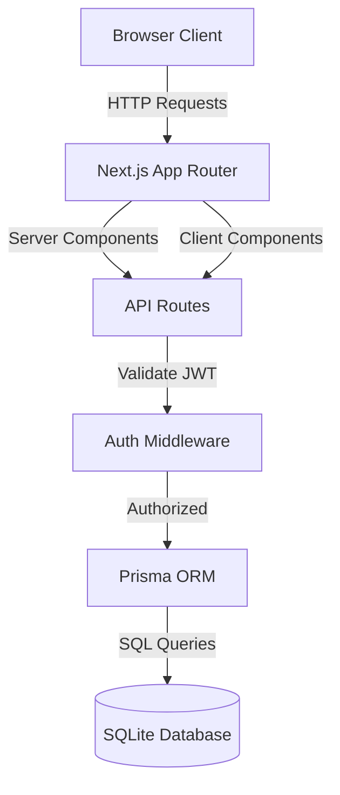
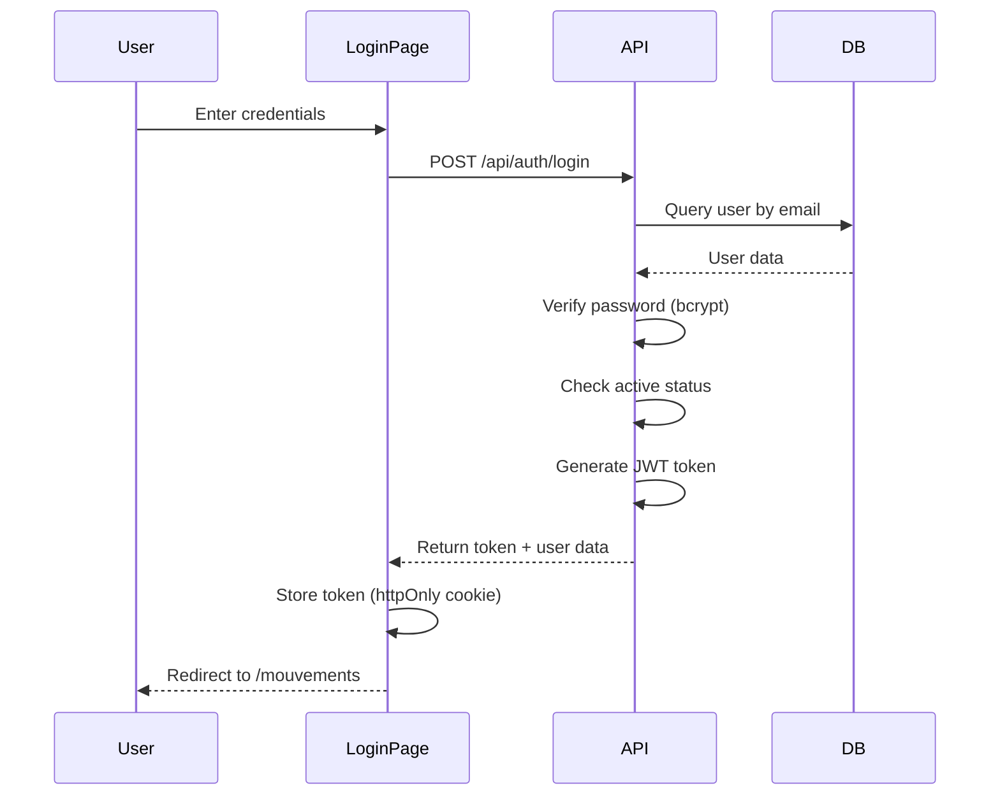

# Design Document - Fluxio

## Overview

Fluxio is a Next.js 14+ full-stack application using the App Router architecture. The application provides a role-based cash management system with server-side rendering, API routes, and a SQLite database managed through Prisma ORM. The design emphasizes simplicity, security, and ease of deployment.

### Technology Stack

- **Framework**: Next.js 14+ (App Router)
- **Language**: TypeScript
- **Database**: SQLite with Prisma ORM
- **Authentication**: JWT tokens with bcrypt password hashing
- **Styling**: TailwindCSS
- **Deployment**: Vercel, Railway, or VPS with Node.js

## Architecture

### High-Level Architecture



### Application Structure

```
fluxio/
├── src/
│   ├── app/
│   │   ├── (auth)/
│   │   │   └── login/
│   │   │       └── page.tsx
│   │   ├── (dashboard)/
│   │   │   ├── layout.tsx          # Protected layout with nav
│   │   │   ├── mouvements/
│   │   │   │   └── page.tsx
│   │   │   ├── intervenants/
│   │   │   │   └── page.tsx        # Admin only
│   │   │   └── utilisateurs/
│   │   │       └── page.tsx        # Admin only
│   │   ├── api/
│   │   │   ├── auth/
│   │   │   │   ├── login/route.ts
│   │   │   │   └── logout/route.ts
│   │   │   ├── users/route.ts
│   │   │   ├── intervenants/route.ts
│   │   │   └── mouvements/route.ts
│   │   └── layout.tsx
│   ├── components/
│   │   ├── ui/                     # Reusable UI components
│   │   ├── forms/                  # Form components
│   │   ├── tables/                 # Table components
│   │   └── navigation/             # Nav components
│   ├── lib/
│   │   ├── prisma.ts               # Prisma client singleton
│   │   ├── auth.ts                 # JWT utilities
│   │   ├── middleware.ts           # Auth middleware
│   │   └── validations.ts          # Zod schemas
│   └── types/
│       └── index.ts                # TypeScript types
├── prisma/
│   ├── schema.prisma               # Database schema
│   └── seed.ts                     # Initial data seeding
├── public/
└── package.json
```

## Components and Interfaces

### Database Schema (Prisma)

```prisma
// prisma/schema.prisma

model User {
  id        String   @id @default(cuid())
  name      String
  email     String   @unique
  password  String   // bcrypt hashed
  role      Role     @default(USER)
  active    Boolean  @default(true)
  createdAt DateTime @default(now())
  updatedAt DateTime @updatedAt
}

enum Role {
  ADMIN
  USER
}

model Intervenant {
  id         String            @id @default(cuid())
  name       String
  type       IntervenantType
  active     Boolean           @default(true)
  createdAt  DateTime          @default(now())
  updatedAt  DateTime          @updatedAt
  mouvements Mouvement[]
}

enum IntervenantType {
  CLIENT
  FOURNISSEUR
  ASSOCIE
  CAISSE_BANQUE
  AUTRE
}

model Mouvement {
  id            String          @id @default(cuid())
  date          DateTime
  intervenantId String
  intervenant   Intervenant     @relation(fields: [intervenantId], references: [id], onDelete: Restrict)
  type          MouvementType
  amount        Float
  reference     String?
  modality      Modality?
  note          String?
  createdAt     DateTime        @default(now())
  updatedAt     DateTime        @updatedAt

  @@index([date])
  @@index([intervenantId])
  @@index([type])
}

enum MouvementType {
  ENTREE
  SORTIE
}

enum Modality {
  ESPECES
  CHEQUE
  VIREMENT
  AUTRE
}
```

### Authentication Flow



### API Route Structure

#### Authentication Endpoints

**POST /api/auth/login**

- Request: `{ email: string, password: string }`
- Response: `{ user: { id, name, email, role }, token: string }`
- Sets httpOnly cookie with JWT token

**POST /api/auth/logout**

- Clears authentication cookie
- Response: `{ success: true }`

#### User Management Endpoints (Admin Only)

**GET /api/users**

- Returns list of all users
- Response: `User[]`

**POST /api/users**

- Request: `{ name: string, email: string, password: string, role: Role }`
- Response: `User`

**PATCH /api/users/[id]**

- Request: `{ name?: string, role?: Role, active?: boolean, password?: string }`
- Response: `User`
- Validates: Cannot deactivate last active admin

#### Intervenant Endpoints (Admin Only for mutations)

**GET /api/intervenants**

- Query params: `?type=CLIENT&active=true`
- Response: `Intervenant[]`

**POST /api/intervenants** (Admin only)

- Request: `{ name: string, type: IntervenantType }`
- Response: `Intervenant`

**PATCH /api/intervenants/[id]** (Admin only)

- Request: `{ name?: string, type?: IntervenantType, active?: boolean }`
- Response: `Intervenant`

#### Mouvement Endpoints

**GET /api/mouvements**

- Query params: `?dateFrom=2024-01-01&dateTo=2024-12-31&intervenantId=xxx&type=ENTREE`
- Response: `{ mouvements: Mouvement[], summary: { totalEntree: number, totalSortie: number, solde: number } }`

**POST /api/mouvements**

- Request: `{ date: string, intervenantId: string, type: MouvementType, amount: number, reference?: string, modality?: Modality, note?: string }`
- Response: `Mouvement`
- Validation: amount > 0, intervenant must be active

**PATCH /api/mouvements/[id]** (Admin only)

- Request: Same as POST
- Response: `Mouvement`

**DELETE /api/mouvements/[id]** (Admin only)

- Response: `{ success: true }`

### Middleware & Authorization

```typescript
// lib/auth.ts

export interface JWTPayload {
  userId: string;
  email: string;
  role: Role;
}

export async function verifyToken(token: string): Promise<JWTPayload | null> {
  // Verify JWT and return payload
}

export async function hashPassword(password: string): Promise<string> {
  // bcrypt hash with salt rounds = 10
}

export async function comparePassword(password: string, hash: string): Promise<boolean> {
  // bcrypt compare
}

// Middleware for API routes
export async function requireAuth(request: Request): Promise<JWTPayload> {
  // Extract token from cookie
  // Verify token
  // Return payload or throw 401
}

export async function requireAdmin(request: Request): Promise<JWTPayload> {
  const user = await requireAuth(request);
  if (user.role !== "ADMIN") {
    throw new Error("Forbidden");
  }
  return user;
}
```

### Client-Side Route Protection

```typescript
// middleware.ts (Next.js middleware)

export async function middleware(request: NextRequest) {
  const token = request.cookies.get("auth-token");
  const { pathname } = request.nextUrl;

  // Public routes
  if (pathname.startsWith("/login")) {
    if (token) {
      return NextResponse.redirect(new URL("/mouvements", request.url));
    }
    return NextResponse.next();
  }

  // Protected routes
  if (!token) {
    return NextResponse.redirect(new URL("/login", request.url));
  }

  // Verify token and check role for admin routes
  const payload = await verifyToken(token.value);
  if (!payload) {
    return NextResponse.redirect(new URL("/login", request.url));
  }

  // Admin-only routes
  if ((pathname.startsWith("/intervenants") || pathname.startsWith("/utilisateurs")) && payload.role !== "ADMIN") {
    return NextResponse.redirect(new URL("/mouvements", request.url));
  }

  return NextResponse.next();
}

export const config = {
  matcher: ["/((?!api|_next/static|_next/image|favicon.ico).*)"],
};
```

## Data Models

### TypeScript Interfaces

```typescript
// types/index.ts

export enum Role {
  ADMIN = "ADMIN",
  USER = "USER",
}

export enum IntervenantType {
  CLIENT = "CLIENT",
  FOURNISSEUR = "FOURNISSEUR",
  ASSOCIE = "ASSOCIE",
  CAISSE_BANQUE = "CAISSE_BANQUE",
  AUTRE = "AUTRE",
}

export enum MouvementType {
  ENTREE = "ENTREE",
  SORTIE = "SORTIE",
}

export enum Modality {
  ESPECES = "ESPECES",
  CHEQUE = "CHEQUE",
  VIREMENT = "VIREMENT",
  AUTRE = "AUTRE",
}

export interface User {
  id: string;
  name: string;
  email: string;
  role: Role;
  active: boolean;
  createdAt: Date;
  updatedAt: Date;
}

export interface Intervenant {
  id: string;
  name: string;
  type: IntervenantType;
  active: boolean;
  createdAt: Date;
  updatedAt: Date;
}

export interface Mouvement {
  id: string;
  date: Date;
  intervenantId: string;
  intervenant?: Intervenant;
  type: MouvementType;
  amount: number;
  reference?: string;
  modality?: Modality;
  note?: string;
  createdAt: Date;
  updatedAt: Date;
}

export interface MouvementSummary {
  totalEntree: number;
  totalSortie: number;
  solde: number;
}

export interface MouvementFilters {
  dateFrom?: string;
  dateTo?: string;
  intervenantId?: string;
  type?: MouvementType;
}
```

### Validation Schemas (Zod)

```typescript
// lib/validations.ts

import { z } from "zod";

export const loginSchema = z.object({
  email: z.string().email(),
  password: z.string().min(6),
});

export const createUserSchema = z.object({
  name: z.string().min(2),
  email: z.string().email(),
  password: z.string().min(6),
  role: z.enum(["ADMIN", "USER"]),
});

export const updateUserSchema = z.object({
  name: z.string().min(2).optional(),
  role: z.enum(["ADMIN", "USER"]).optional(),
  active: z.boolean().optional(),
  password: z.string().min(6).optional(),
});

export const createIntervenantSchema = z.object({
  name: z.string().min(2),
  type: z.enum(["CLIENT", "FOURNISSEUR", "ASSOCIE", "CAISSE_BANQUE", "AUTRE"]),
});

export const updateIntervenantSchema = z.object({
  name: z.string().min(2).optional(),
  type: z.enum(["CLIENT", "FOURNISSEUR", "ASSOCIE", "CAISSE_BANQUE", "AUTRE"]).optional(),
  active: z.boolean().optional(),
});

export const createMouvementSchema = z.object({
  date: z.string().datetime(),
  intervenantId: z.string(),
  type: z.enum(["ENTREE", "SORTIE"]),
  amount: z.number().positive(),
  reference: z.string().optional(),
  modality: z.enum(["ESPECES", "CHEQUE", "VIREMENT", "AUTRE"]).optional(),
  note: z.string().optional(),
});

export const mouvementFiltersSchema = z.object({
  dateFrom: z.string().optional(),
  dateTo: z.string().optional(),
  intervenantId: z.string().optional(),
  type: z.enum(["ENTREE", "SORTIE"]).optional(),
});
```

## Error Handling

### API Error Response Format

```typescript
interface APIError {
  error: string;
  message: string;
  statusCode: number;
  details?: any;
}
```

### Error Handling Strategy

1. **Validation Errors (400)**

   - Zod validation failures
   - Invalid input data
   - Business rule violations (e.g., amount <= 0)

2. **Authentication Errors (401)**

   - Invalid credentials
   - Missing or expired JWT token
   - Inactive user account

3. **Authorization Errors (403)**

   - Insufficient permissions
   - Role-based access denial

4. **Not Found Errors (404)**

   - Resource doesn't exist
   - Invalid ID

5. **Conflict Errors (409)**

   - Duplicate email
   - Cannot delete last admin
   - Cannot delete intervenant with movements

6. **Server Errors (500)**
   - Database connection failures
   - Unexpected exceptions

### Client-Side Error Handling

- Display toast notifications for API errors
- Form validation errors shown inline
- Confirmation dialogs for destructive actions
- Graceful fallbacks for failed data fetches

## Testing Strategy

### Unit Tests

- **Authentication utilities**: Password hashing, JWT generation/verification
- **Validation schemas**: Zod schema validation
- **Business logic**: Solde calculation, permission checks

### Integration Tests

- **API Routes**: Test all endpoints with various scenarios
  - Successful operations
  - Validation failures
  - Authorization checks
  - Edge cases (last admin, inactive intervenant, etc.)

### E2E Tests (Optional)

- **Critical user flows**:
  - Login → Create movement → View in list
  - Admin: Create user → Login as new user
  - Admin: Deactivate intervenant → Verify not in dropdown

### Testing Tools

- **Jest**: Unit and integration tests
- **Playwright** (optional): E2E tests
- **Prisma**: In-memory SQLite for test database

## UI/UX Design Considerations

### Layout Structure

```
┌─────────────────────────────────────────┐
│  Fluxio Logo    Nav Links    [Logout]   │ ← Header
├─────────────────────────────────────────┤
│                                         │
│  ┌───────────────────────────────────┐ │
│  │  Page Content                     │ │
│  │  - Filters                        │ │
│  │  - Summary Cards                  │ │
│  │  - Data Table                     │ │
│  │  - Action Buttons                 │ │
│  └───────────────────────────────────┘ │
│                                         │
└─────────────────────────────────────────┘
```

### Key UI Components

1. **Navigation Bar**

   - Logo/Brand
   - Role-based menu items
   - User info + logout button

2. **Data Tables**

   - Sortable columns
   - Pagination (if needed)
   - Row actions (edit/delete for admin)
   - Responsive design

3. **Forms**

   - Modal or slide-over for create/edit
   - Inline validation
   - Clear error messages
   - Loading states

4. **Summary Cards**

   - Total Entrée (green)
   - Total Sortie (red)
   - Solde (blue if positive, red if negative)

5. **Filters**
   - Date range picker
   - Dropdown selects
   - Clear filters button
   - Apply button (or auto-apply)

### Responsive Design

- Mobile-first approach
- Tables collapse to cards on mobile
- Hamburger menu for navigation on small screens
- Touch-friendly buttons and inputs

## Security Considerations

1. **Password Security**

   - bcrypt with salt rounds = 10
   - Minimum 6 characters (configurable)
   - No password in API responses

2. **JWT Security**

   - httpOnly cookies (prevent XSS)
   - Secure flag in production
   - Short expiration (24 hours)
   - Refresh token strategy (optional for MVP)

3. **SQL Injection Prevention**

   - Prisma ORM handles parameterization
   - No raw SQL queries

4. **XSS Prevention**

   - React escapes output by default
   - Sanitize user input in notes/references

5. **CSRF Protection**

   - SameSite cookie attribute
   - Next.js built-in CSRF protection

6. **Rate Limiting** (Optional for MVP)
   - Limit login attempts
   - API rate limiting

## Deployment Strategy

### Environment Variables

```env
DATABASE_URL="file:./dev.db"
JWT_SECRET="your-secret-key-here"
NODE_ENV="production"
```

### Deployment Options

1. **Vercel (Recommended for simplicity)**

   - One-click deploy from GitHub
   - Automatic HTTPS
   - Edge functions for API routes
   - Note: SQLite requires persistent storage (use Vercel Postgres or external DB)

2. **Railway.app**

   - Supports SQLite with persistent volumes
   - Simple deployment from GitHub
   - Built-in database backups

3. **VPS (DigitalOcean, Hetzner)**
   - Full control
   - PM2 for process management
   - Nginx reverse proxy
   - Manual backups of SQLite file

### Database Considerations

- **Development**: SQLite file in project root
- **Production**:
  - Option 1: SQLite with persistent volume (Railway, VPS)
  - Option 2: PostgreSQL (Vercel Postgres, Supabase)
  - Migration path: Prisma supports both, minimal code changes

### Initial Data Seeding

```typescript
// prisma/seed.ts

import { PrismaClient } from "@prisma/client";
import { hashPassword } from "../src/lib/auth";

const prisma = new PrismaClient();

async function main() {
  // Create default admin user
  const adminPassword = await hashPassword("admin123");

  await prisma.user.create({
    data: {
      name: "Admin",
      email: "admin@fluxio.com",
      password: adminPassword,
      role: "ADMIN",
      active: true,
    },
  });

  console.log("Seed data created");
}

main()
  .catch(console.error)
  .finally(() => prisma.$disconnect());
```

## Performance Optimization

1. **Database Indexing**

   - Index on `mouvement.date` for date range queries
   - Index on `mouvement.intervenantId` for filtering
   - Index on `mouvement.type` for type filtering

2. **Query Optimization**

   - Use Prisma `select` to fetch only needed fields
   - Eager load intervenant data with movements
   - Implement pagination for large datasets

3. **Caching Strategy** (Optional for MVP)

   - Cache intervenant list (rarely changes)
   - Cache user session data
   - Use React Query for client-side caching

4. **Server Components**
   - Use Next.js Server Components for initial page loads
   - Reduce client-side JavaScript bundle
   - Faster time to interactive

## Future Enhancements (Out of Scope for MVP)

- Export movements to Excel/PDF
- Advanced reporting and charts
- Multi-currency support
- Audit log for all changes
- Email notifications
- Mobile app (React Native)
- Bulk import from Excel
- Recurring movements
- Categories/tags for movements
- Budget tracking and alerts
